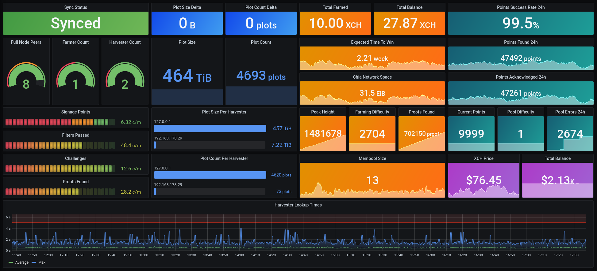
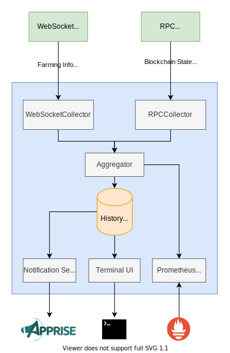

# sit-monitor [](https://discord.gg/K5KyD9mXDh)

A monitoring tool to collect all important metrics from your [Silicoin](https://github.com/sitcoin-gl/sit-blockchain) farming node and connected harvesters.

These metrics are collected from the Silicoin daemon via RPC and WebSocket interfaces and can also be used to send you push notifications with regular status updates, alert you if something goes wrong, a proof is found, or you receive payments to your farmer wallet.

All metrics are exported to a [Prometheus](https://github.com/prometheus/prometheus) compatible `/metrics` endpoint and a [Grafana](https://github.com/grafana/grafana) dashboard is also provided:



This example dashboard displays almost all collected metrics and can be imported from [grafana.com](https://grafana.com/grafana/dashboards/14544) using the ID `14544` or using the `grafana/dashboard.json` from this repository.

## How to Support

If you find this tool helpful and want to support the development, feel free to give this repo a ⭐ or donate some Silicoin (SIT) to my address: `gl1w9clzakz3rmyw7d2q7j233uy8afp8ymeqmpjs5wa8s5j3a4cla5sycrlmq`

## Notifications

To use notifications, please configure a `status_service_url` and `alert_service_url` for your desired notification service in the `config.json`. You can use most popular notifications services by creating a service specific webhook URL, following the instructions from [this](https://github.com/caronc/apprise/wiki) wiki. If you wish to disable notifications entirely, you can set the `enable` flag in the `notifications` section of the `config.json` to `false`.

---
Following notifications are currently sent to the `status_service_url`:

### Farm summary (configurable interval in `config.json`)

```md
** 👨‍🌾 Farm Status 👩‍🌾 **
🌾 OG Plot Count: 3797
🌾 Portable Plot Count: 50
🧺 OG Plot Size: 375.828 TiB
🧺 Portable Plot Size: 4.948 TiB
🚜 Plot Change 24h: +86 (+8.511 TiB)
⌛️ Signage Points Per Minute: 6.30
🔎 Passed Filters Per Minute: 49.30
✅ Total Proofs found: 73
💰 Total Balance: 2.00001 SIT
🕰️ Time To Win: 2 weeks and 4 days
💾 Current Netspace: 30.706 EiB
🏔️ Peak Height: 544594
🧮 Mempool Size: 15
📶 Full Node Peer Count: 8
🔄 Synced: True
```

### Proof found alert

Triggers when a new partial or full proof is found. To limit the amount of notifications when pooling, this can be disabled in the config using the `disable_proof_found_alert` setting.

```md
** 🤑 Proof found! 🤑 **
Your farm found a new partial or full proof
```

---
Following notifications are currently sent to the `alert_service_url`:

### Sync lost alert

```md
** 🚨 Farmer Lost Sync! 🚨 **
It seems like your farmer lost its connection to the Silicoin Network
```

### Sync recovery alert

```md
** ✅ Farmer Synced! ✅ **
Your farmer is successfully synced to the Silicoin Network again
```

### Plots lost alert

Triggers when the total plot count of your farm drops below a configurable threshold (default: 1).

The corresponding `lost_plots_alert_threshold` parameter can be adjusted in the `config.json`.

```md
** 🚨 Farmer Lost Plots! 🚨 **
It seems like your farmer lost some plots
Expected: 130, Found: 124
```

### Plots recovery alert

```md
** ✅ Farmer Plots recoverd! ✅ **
Your farmer's plot count has recovered to its previous value
```

### Payment alert

```md
** 🤑 Payment received! 🤑 **
Your wallet received a new payment
🌱 +0.10240 SIT
```

---

## Metrics

The following statistics are collected from your local [Silicoin](https://github.com/sitcoind-gl/sit-blockchain) node using the [RPC](https://github.com/Chia-Network/chia-blockchain/wiki/RPC-Interfaces) and WebSocket APIs and are then exported via a [Prometheus](https://github.com/prometheus/prometheus) compatible `/metrics` HTTP endpoint on the `exporter_port` from your `config.json`.

### Supported wallet metrics

- Total balance (`sit_confirmed_total_mojos`)
- Total farmed (`sit_farmed_total_mojos`)

### Supported full node metrics

- Sync status (`sit_sync_status`)
- Peak height (`sit_peak_height`)
- Mempool size (`sit_mempool_size`)
- Difficulty (`sit_diffculty`)
- Total netspace (`sit_network_space`)
- Connection count (`sit_connections_count`)

### Supported harvester metrics

- OG plot count (`sit_plot_count`)
- OG plot size (`sit_plot_size`)
- Portable plot count (`sit_portable_plot_count`)
- Portable plot size (`sit_portable_plot_size`)

### Supported farmer metrics

- Received signage points (`sit_signage_points`)
- Received signage point index (`sit_signage_point_index`)
- Attempted challenges (`sit_block_challenges`)
- Plots passed filter (`sit_plots_passed_filter`)
- Proofs found (`sit_proofs_found`)
- Lookup time (`sit_lookup_time_seconds`)

### Supported pooling metrics

- Current Points (`sit_current_pool_points`)
- Current difficulty (`sit_current_pool_difficulty`)
- Points found (`sit_pool_points_found_since_start`)
- Points acknowledged (`sit_pool_points_acknowledged_since_start`)
- Points found 24h (`sit_pool_points_found_24h`)
- Points acknowledged 24h (`sit_pool_points_acknowledged_24h`)
- Pool errors 24h (`sit_num_pool_errors_24h`)

All pooling metrics support the following labels:

- P2 singleton address (`p2`)
- Pool URL (`url`)

### Supported price metrics

- USD price (`sit_price_usd_cent`)
- EUR price (`sit_price_eur_cent`)
- BTC price (`sit_price_btc_satoshi`)
- ETH price (`sit_price_eth_gwei`)

## Prerequisites

To run this tool, we need the following things:

- Python 3
- Pipenv

### Linux (Ubuntu)

```bash
sudo apt install python3
```

## Installation

1. Clone the repository

```bash
git clone https://github.com/Meeea-914/gold-monitor.git -b sit
cd gold-monitor
```
2. Create and activate venv 
```bash
python -m venv venv
source ./venv/bin/activate
```
3. Install the required dependecies

```bash
pip install -r requirements.txt 
```

4. Initialize the SQLite database

```bash```
python -m alembic upgrade head
```

5. Copy the example config file

```bash
cp config-example.json config.json
```

6. Open up `config.json` and configure it to your preferences.

## Updating

1. Pull the latest release from git

```bash
cd sit-monitor
git reset origin/main --hard
git pull
```

2. Update the required dependecies

```bash
source ./venv/bin/activate
pip install -r requirements.txt
```

3. Upgrade the SQLite database model

```bash
python -m alembic upgrade head
```

4. Import (Overwrite) the Grafana dashboard using the `grafana/dashboard.json`

## Usage

To use the tool, run the `monitor` module using `pipenv` from the `sit-monitor` directory

```bash
cd sit-monitor
source ./venv/bin/activate
python -m monitor
```

_Note: To run the tool in the background, you can run it as a [service](https://wiki.archlinux.org/title/systemd#Writing_unit_files) or in a detached [screen](https://wiki.archlinux.org/title/GNU_Screen)._

### Basic Prometheus Configuration

Add a block to the `scrape_configs` of your `prometheus.yml` config file:

```yaml
scrape_configs:
  - job_name: sit_monitor
    static_configs:
    - targets: ['<<SILICOIN-MONITOR-HOSTNAME>>:14800']
```

and adjust the host name accordingly.

## Architecture

